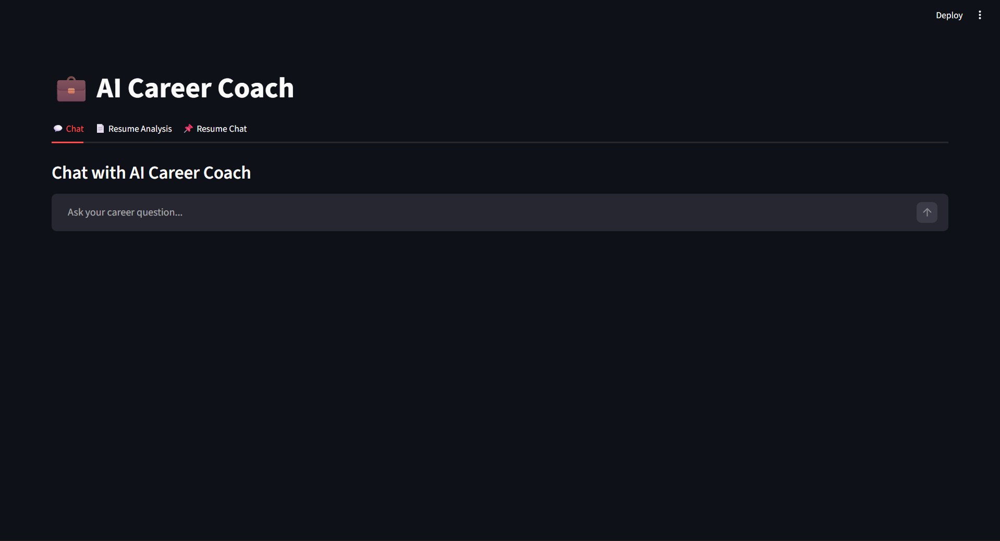
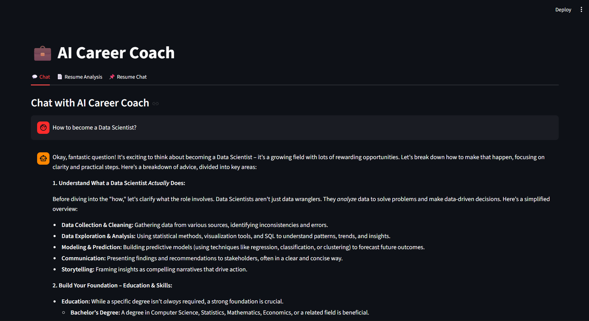
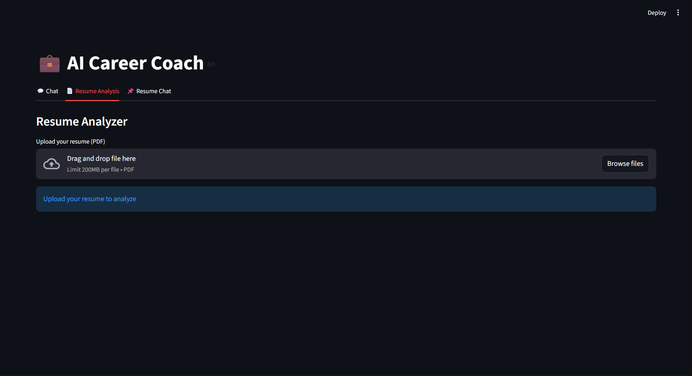
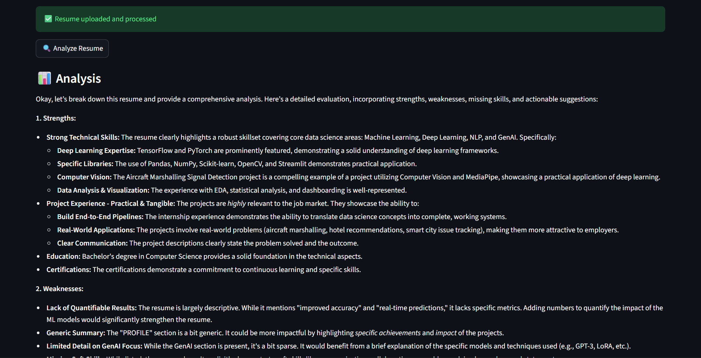
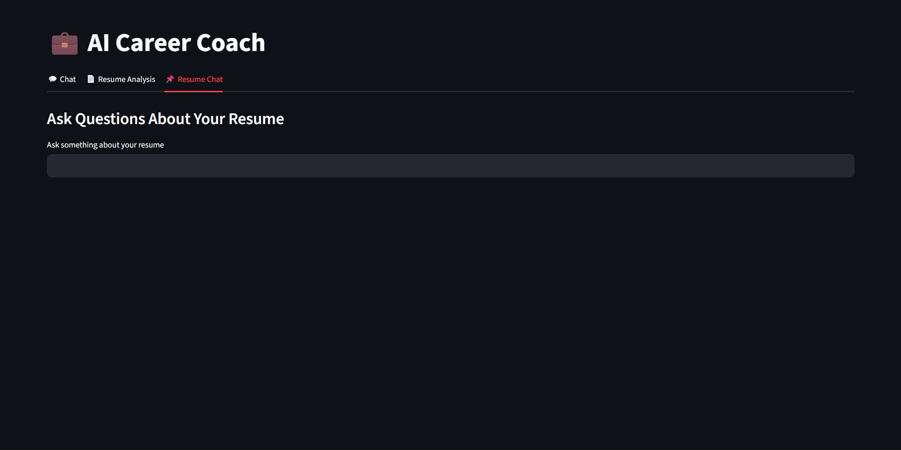
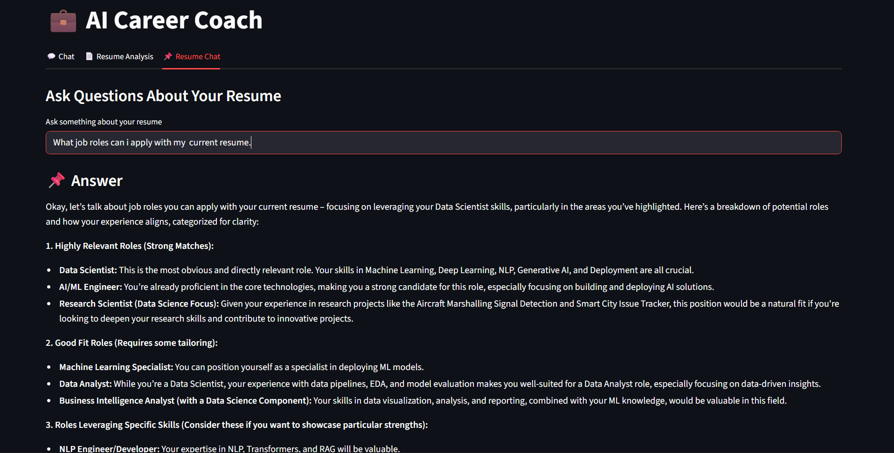

# 💼 AI Career Coach Chatbot

An AI-powered career assistant that helps users with career guidance, resume analysis, and resume-based Q&A using RAG (Retrieval-Augmented Generation).

---

## 🚀 Features

- 💬 AI Career Chat  
  Ask career-related questions and get guidance on skills, jobs, and interviews  

- 📄 Resume Analyzer  
  Upload your resume (PDF) and get:
  - Strengths  
  - Weaknesses  
  - Missing skills  
  - Improvement suggestions  

- 📌 Resume Q&A (RAG)  
  Ask questions based on your resume using FAISS + embeddings  

- ⚡ Local LLM (No API Cost)  
  Powered by Ollama (Gemma / LLaMA), runs locally without paid APIs  

---

## 🧠 Tech Stack

- Python  
- Streamlit  
- LangChain  
- Ollama  
- FAISS  
- PyPDF  

---

## 🏗️ Project Structure

ai-career-coach/  
│  
├── app.py  
├── chatbot.py  
├── resume_parser.py  
├── rag_pipeline.py  
├── requirements.txt  
├── README.md  

---

## ⚙️ How It Works

1. Upload resume (PDF)  
2. Extract text using PyPDF  
3. Split into chunks  
4. Convert to embeddings (Ollama)  
5. Store in FAISS vector database  
6. User asks question  
7. Relevant chunks are retrieved  
8. LLM generates response  

---

## ▶️ Run Locally

1. Clone repository  
git clone https://github.com/Ebin017/ai-career-coach-chatbot.git  
cd ai-career-coach-chatbot  

2. Install dependencies  
pip install -r requirements.txt  

3. Start Ollama  
ollama serve  

4. Pull models  
ollama pull gemma3:1b  
ollama pull nomic-embed-text  

5. Run app  
streamlit run app.py  

---

## 📸 Demo

### 💬 Chat Interface

### 💬 Chat Conversation Example

### 📄 Resume Upload & Processing

### 📊 Resume Analysis Output

### 📌 Resume Q&A (RAG)

### ⚡ AI Response from Resume Context

---

## 💡 Key Concepts Used

- Prompt Engineering  
- Retrieval-Augmented Generation (RAG)  
- Embeddings & Vector Search  
- Local LLM Deployment  

---

## 🚀 Future Improvements

- Voice interaction  
- Chat history export  
- Deployment  
- UI enhancements  

---

## 🙌 Author

Ebin Raj  
Aspiring Data Scientist / AI Engineer  

---
